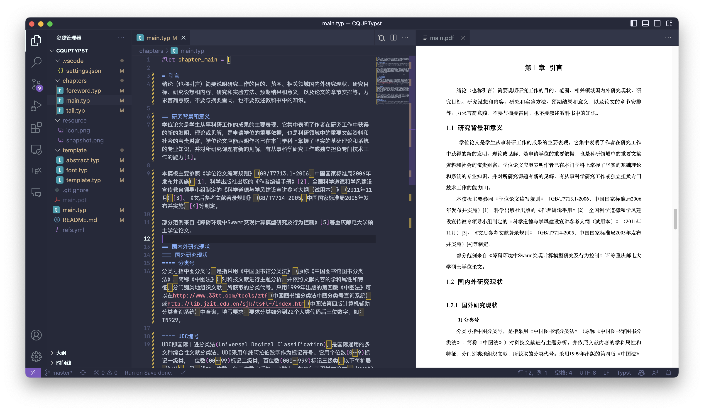

# CQUPTypst

# !!!WARN!!!: 最终模板可正常使用并在23年正常提交为毕业论文，但是需要一些额外工作才可更新至此。本仓库模板为最初版本，需要用则提 Issue 或是给我发邮件，我在看到后会更新

一个 Typst 模板，但是大专

模板参考文件: [毕业设计（论文）参考模板-校级](https://fls.tisato.live/preview?file=/attachments/毕业设计（论文）参考模板-校级.doc)



## 用法

> 如果你装了 `Typst LSP`，那么你需要将 `Typst-lsp: Export Pdf` 改为 `never`

1. Clone 本项目
2. 安装 `typest`

```bash
# Mac
brew install typst

# Windows
scoop install typst   # maybe, unverified
```

3. (Optional) VSCode 安装 `Typest LSP`、`Run on Save` 插件
4. 更改 `chapters` 的内容
5. 运行命令 `typst compile main.typ`

## 限制
> 不过你可以等随缘更新
- 封面没做，你可以 Word 导出后粘到前面
- 四级五级标题没做
- 页眉页脚没做
- 其它暂时不知道
